# smartdns-webui-patch

这是一个基于 [smartdns-webui](https://github.com/pymumu/smartdns-webui) 原版之上补全配置 UI 的项目。

## 项目说明

本项目在原版 SmartDNS Web 管理界面的基础上，增加了一个**参数配置**的二级菜单。通过该菜单，用户可以在 Web 界面中完成所有原本需要手动编辑配置文件才能实现的配置功能，无需再通过 SSH 或其他方式修改 `smartdns.conf` 文件。

## 主要特性

- **完整的配置管理**：支持 SmartDNS 所有配置项的 Web 界面管理
- **17 个配置分类**：按功能将配置项分类展示，便于查找和管理
- **多值配置支持**：支持添加多个 DNS 服务器、地址规则等重复配置项
- **双栈支持**：所有监听配置均支持 IPv4/IPv6 双栈
- **自动重启**：保存配置后可自动重启 SmartDNS 服务使配置生效
- **自动刷新**：重启服务后自动重新加载最新配置
- **中文界面**：所有按钮和提示信息均已汉化
- **原始配置**：支持直接编辑配置文件原始文本

## 一键安装（推荐）

### 下载安装包

从 [Releases](https://github.com/yuxuan0107/smartdns-webui-patch/releases) 下载最新版本的安装包。

### 安装步骤

```bash
# 1. 下载安装包
wget https://github.com/yuxuan0107/smartdns-webui-patch/releases/download/v20260710/smartdns-webui-patch-20260710.tar.gz

# 2. 解压
tar -xzf smartdns-webui-patch-20260710.tar.gz
cd smartdns-webui-patch-20260710

# 3. 运行安装脚本
sudo ./install.sh
```

### 安装完成后

- 访问 `http://<服务器IP>:6080`
- 用户名: `admin`
- 密码: `password`

### 卸载

```bash
sudo ./uninstall.sh
```

## 手动编译安装

### 前置要求

- Node.js 18+
- SmartDNS 已安装并配置 WebUI 插件

### 编译步骤

```bash
# 1. 克隆仓库
git clone https://github.com/yuxuan0107/smartdns-webui-patch.git
cd smartdns-webui-patch

# 2. 安装依赖
npm install

# 3. 编译项目
npm run build

# 4. 部署到 SmartDNS
cp -r out/* /usr/share/smartdns/wwwroot/
```

### 配置 SmartDNS

在 smartdns.conf 中添加：

```conf
# web ui plugin
plugin smartdns_ui.so
smartdns-ui.www-root /usr/share/smartdns/wwwroot
smartdns-ui.ip http://0.0.0.0:6080
smartdns-ui.user admin
smartdns-ui.password password
```

## 使用方法

1. 访问 `http://<服务器IP>:6080`
2. 输入用户名和密码登录
3. 点击左侧菜单"参数配置"
4. 选择对应的配置分类进行修改
5. 点击"保存配置"保存修改
6. 点击"重启服务"使配置生效

## 界面截图

### 登录页面


### 仪表盘
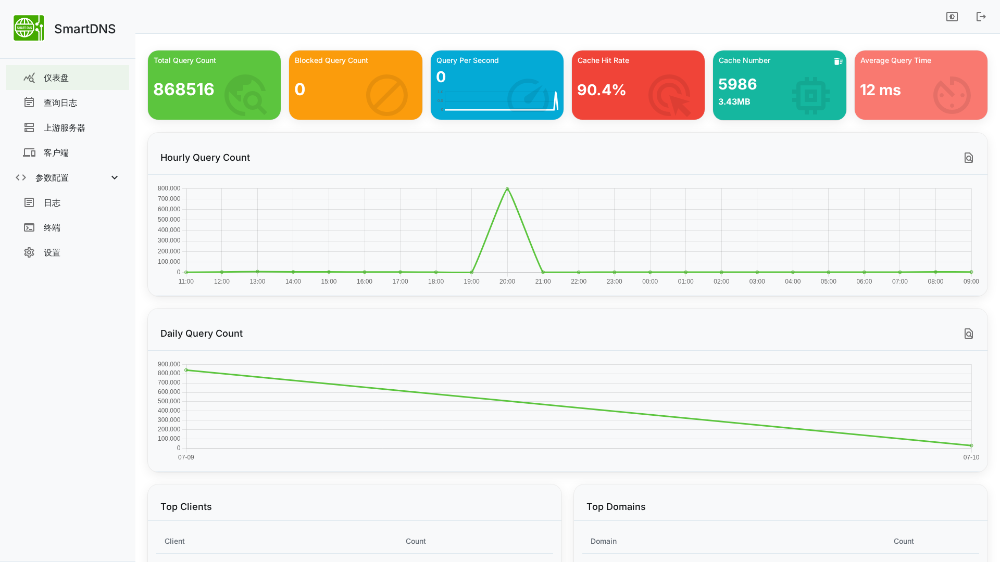

### 基本设置
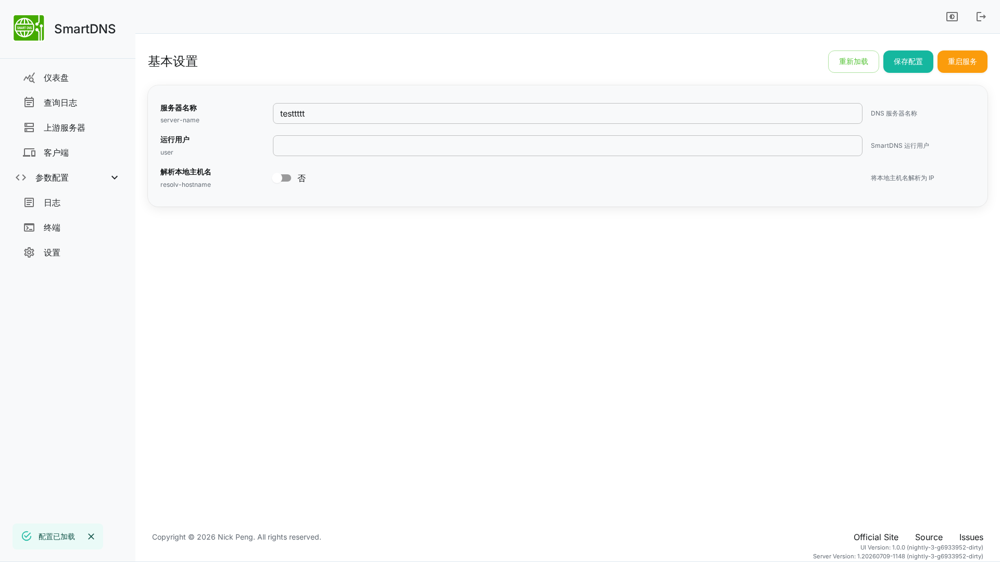

### 监听设置
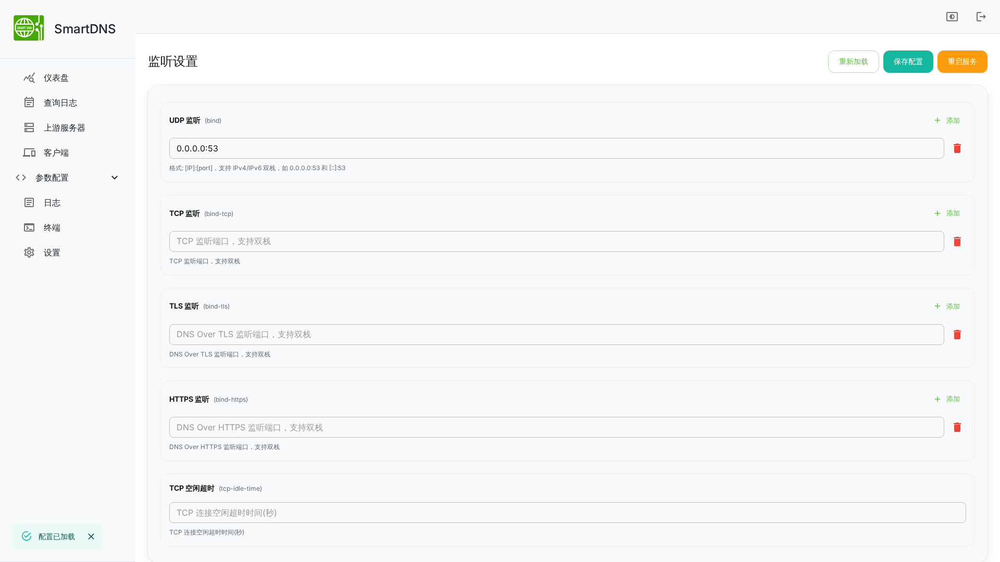

### TLS 证书
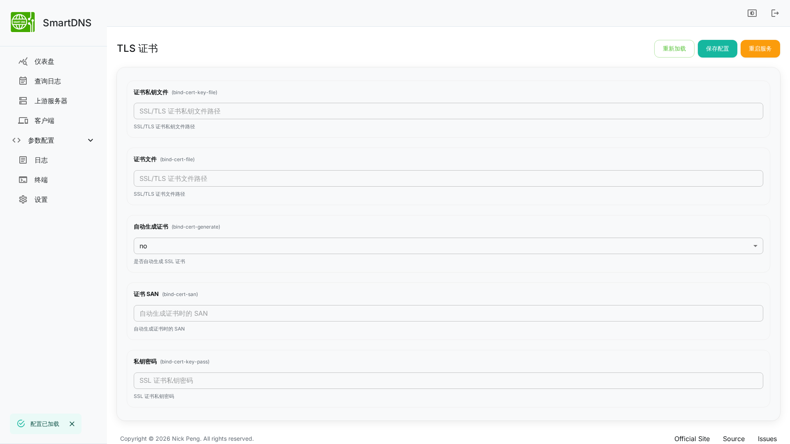

### 缓存设置
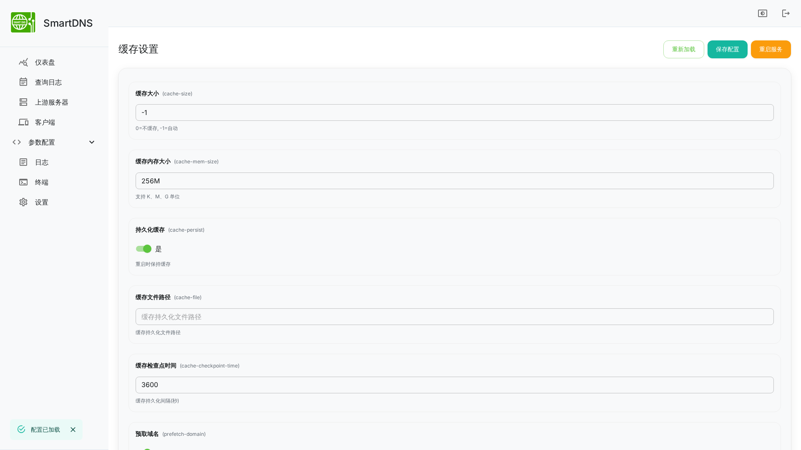

### DNS 服务器
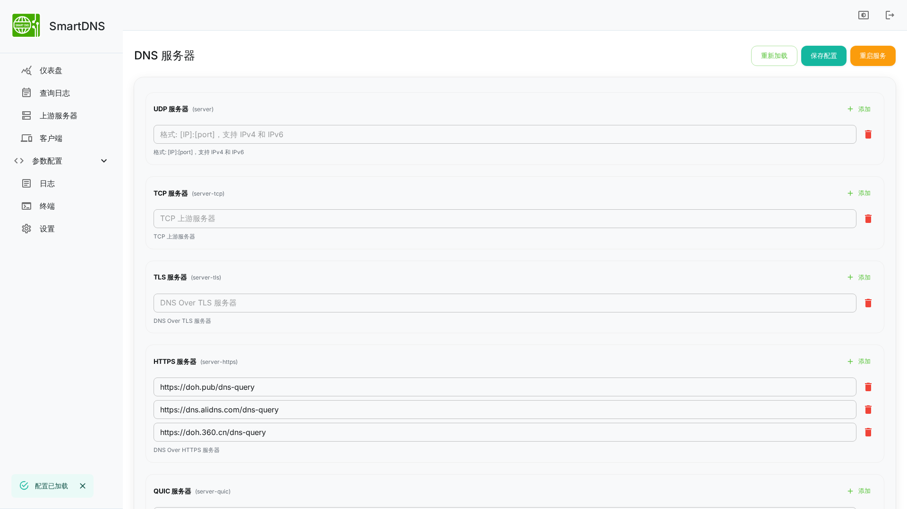

### 代理设置
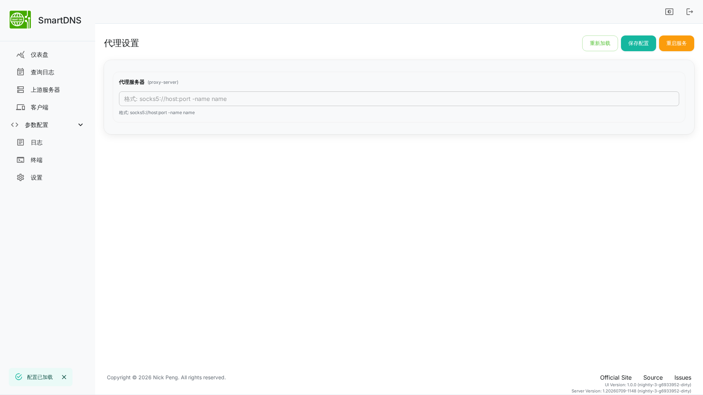

### 过滤规则
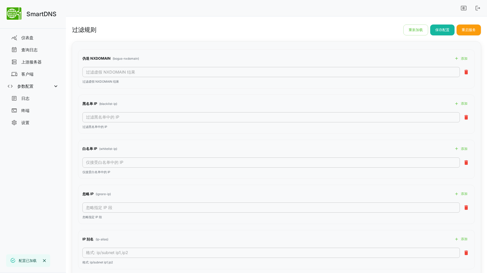

### 地址规则
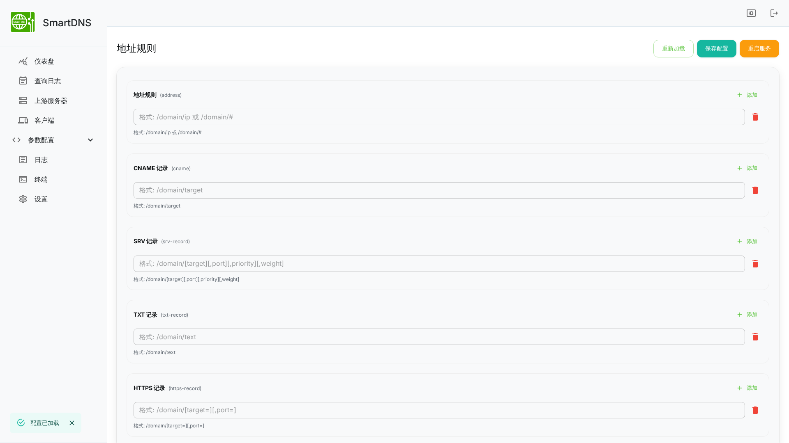

### 分流规则
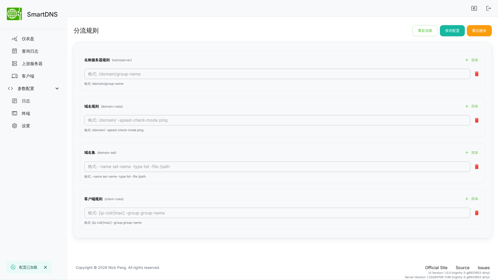

### 日志设置
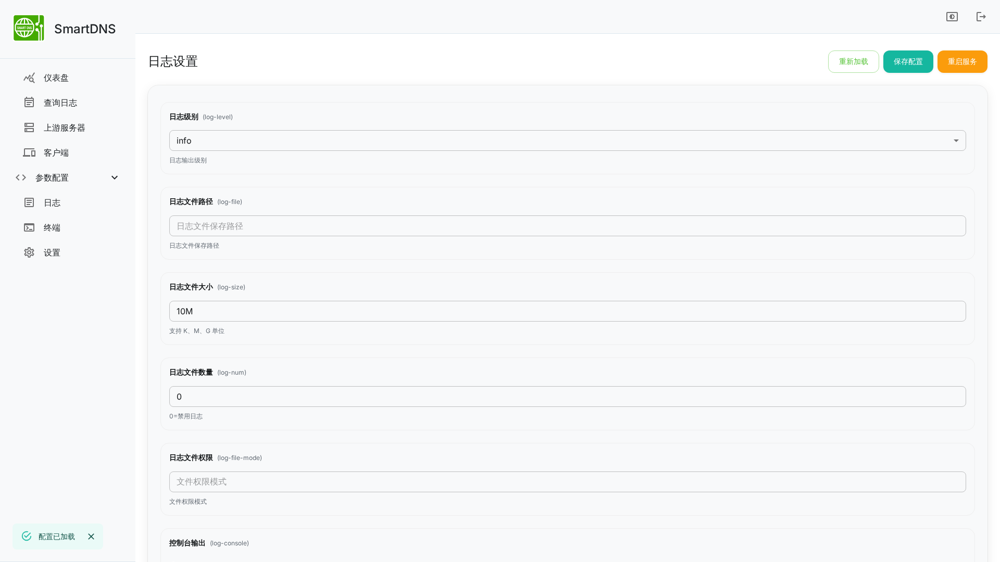

### 高级选项
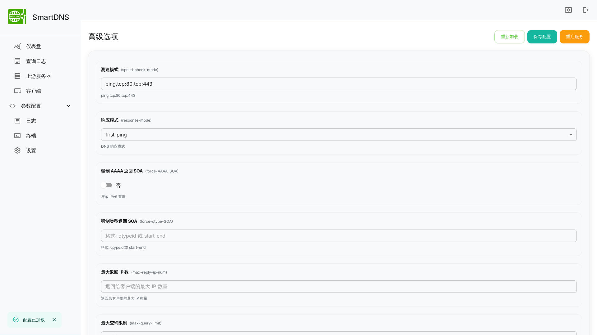

### TTL 设置
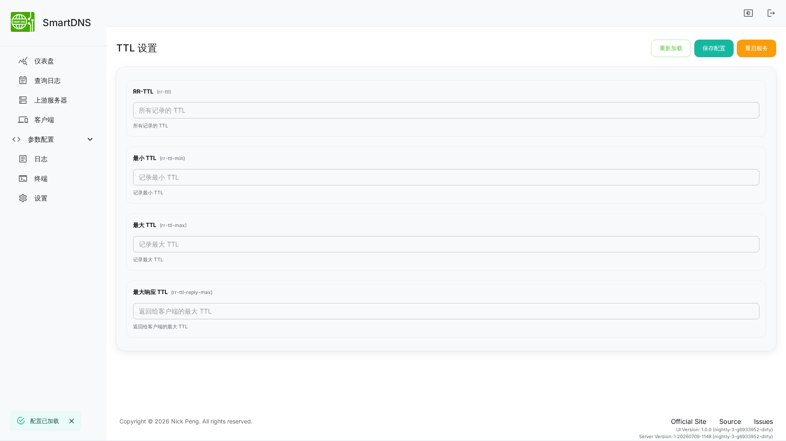

### 其他设置
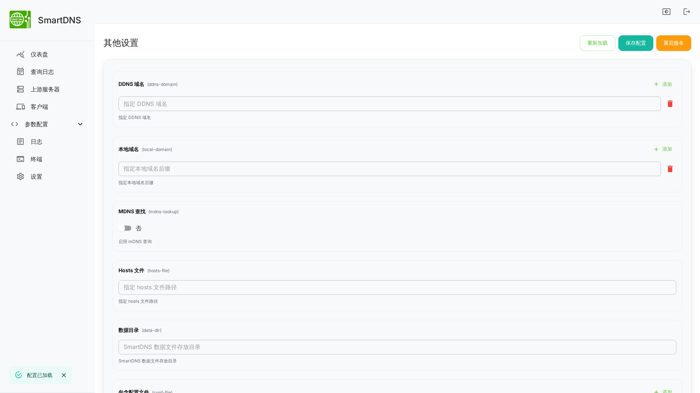

### 原始配置
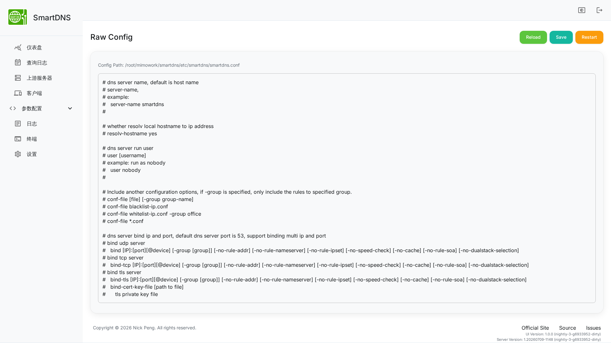

## 配置菜单结构

### 参数配置

| 菜单项 | 包含的配置项 |
|--------|-------------|
| 基本设置 | server-name, user, resolv-hostname |
| 监听设置 | bind, bind-tcp, bind-tls, bind-https, tcp-idle-time（支持双栈） |
| TLS 证书 | bind-cert-key-file, bind-cert-file, bind-cert-generate, bind-cert-san, bind-cert-key-pass |
| 缓存设置 | cache-size, cache-mem-size, cache-persist, cache-file, cache-checkpoint-time, prefetch-domain, serve-expired, serve-expired-ttl, serve-expired-reply-ttl |
| DNS 服务器 | server, server-tcp, server-tls, server-https, server-quic, server-http3, bootstrap-dns |
| 代理设置 | proxy-server |
| 过滤规则 | bogus-nxdomain, blacklist-ip, whitelist-ip, ignore-ip, ip-alias |
| 地址规则 | address, cname, srv-record, txt-record, https-record |
| 分流规则 | nameserver, domain-rules, domain-set, client-rules |
| IPSet/NFTSet/IP规则 | ipset, ipset-timeout, ipset-no-speed, nftset, nftset-timeout, nftset-no-speed, nftset-debug, ip-rules, ip-set |
| 日志设置 | log-level, log-file, log-size, log-num, log-file-mode, log-console, log-syslog |
| 审计设置 | audit-enable, audit-SOA, audit-file, audit-size, audit-num, audit-file-mode, audit-console, audit-syslog |
| 高级选项 | speed-check-mode, response-mode, force-AAAA-SOA, force-qtype-SOA, max-reply-ip-num, max-query-limit, dualstack-ip-selection, dualstack-ip-selection-threshold, dualstack-ip-allow-force-AAAA, edns-client-subnet, expand-ptr-from-address |
| TTL 设置 | rr-ttl, rr-ttl-min, rr-ttl-max, rr-ttl-reply-max |
| DNS64 | dns64 |
| 分组规则 | group-begin, group-match, group-end |
| 其他设置 | ddns-domain, local-domain, mdns-lookup, hosts-file, data-dir, conf-file, ca-file, ca-path, dnsmasq-lease-file, odhcpd-lease-file |
| 原始配置 | 直接编辑配置文件原始文本 |

## 操作按钮

| 按钮 | 功能 |
|------|------|
| 重新加载 | 从服务器重新加载配置文件 |
| 保存配置 | 保存当前配置到服务器 |
| 重启服务 | 重启 SmartDNS 服务使配置生效 |

## 致谢

- [pymumu/smartdns](https://github.com/pymumu/smartdns) - SmartDNS 核心项目
- [pymumu/smartdns-webui](https://github.com/pymumu/smartdns-webui) - 原版 WebUI

## 许可证

GPL-3.0 License
